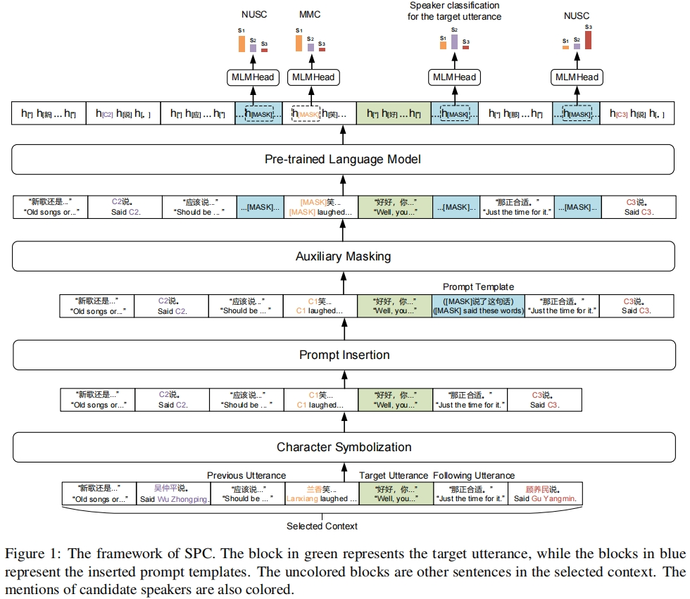
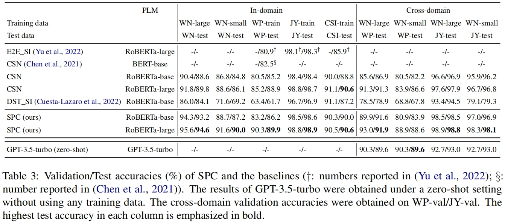

 # SPC for Speaker Identification in Novels
 
 This repository contains code for the paper: *Symbolization, Prompt, and Classification: A Framework for Implicit Speaker Identification in Novels*





## Dependencies

- Python 3
- [PyTorch](http://pytorch.org/) (version 2.0.1)
- [Transformers](http://huggingface.co/transformers/) (version 4.30.2)


## Usage

### Data preparation
The processed version of two speaker identification datasets:
- *World of Plainness* (WP, https://github.com/YueChenkkk/Chinese-Dataset-Speaker-Identification)
- *Jin-Yong Stories* (JY, https://github.com/huayi-dou/The-speaker-identification-corpus-of-Jin-Yong-novels) 

are provided in `data/(wp/jy)_data/(train/dev/test)_instances.json`. You can check `data/build\_(wp/jy)_dataset.py` for preprocessing details.

### Training
We provide a single-node multi-gpu training script. By running the following shell script, you can obtain a model trained on WP data. `--left_aux` and `--right_aux` control the number of neighbourhood utterances on the left and right side of the target utterance for Neighbourhood Utterance Speaker Classification (NUSC). `--prompt_type` == 3 chooses the template "（[MASK]说了这句话）". `--role_mask_prob` controls the probability of masking a character mention in the two adjacent sentences of the target utterance for the auxiliary Mask mention Classification (MMC) task. `--lbd1` and `--lbd2` controls the loss weights of NUSC and MMC.  
For small training sets like WP and JY, we usually disable MMC by setting `--role_mask_prob` and `--lbd2` as negative numbers.
```
MASTER_ADDR=localhost \
MASTER_PORT=SOME_PORT \
CUDA_VISIBLE_DEVICES=0,1,2,3 \
python train.py \
--world-size 4 \
--data-dir ./data/wp_data \
--epoch-num 50 \
--total-batch-size 8 \
--batch-size-per-gpu 4 \
--lr 1e-5 \
--lr-gamma 0.98 \
--early-stop 5 \
--margin 1.0 \
--max-len 512 \
--left-aux 1 \
--right-aux 1 \
--prompt-type 3 \
--role-mask-prob -1.0 \
--lbd1 0.3 \
--lbd2 -1.0 \
--pretrained-dir PRETRAINED_MODEL_DIR/chinese-roberta-wwm-ext-large \
--ckpt-dir SAVE_CHECKPOINT_DIR
```

### Testing
The following script is for testing a checkpoint on the test set of WP. It's also a multi-gpu version, but generally a single gpu is fine for inference.
```
MASTER_ADDR=localhost \
MASTER_PORT=SOME_PORT \
CUDA_VISIBLE_DEVICES=0 \
python test.py \
--world-size 1 \
--output-name test_on_wp \
--ckpt-dir SAVE_CHECKPOINT_DIR \
--data-dir ./data/wp_data \
--batch-size 4
```

## FAQ
### 1. Why MMC is disabled here?
In practice we observed the auxiliary Mask mention Classification (MMC) task couldn't bring steady improvements for smaller training sets with less than 100k examples (like WP and JY). So we keep setting `--role_mask_prob` < 0 and `--lbd2` < 0 in the released code to disable MMC. If you have a bigger training data, we recommend you try `--role_mask_prob` = 0.5 and `--lbd2` == 0.3.

## Citation
If you find our code useful, please cite the following paper:

```bibtex
@inproceedings{chen2023symbolization,
      booktitle={Findings of the Association for Computational Linguistics: EMNLP 2023},
      title={Symbolization, Prompt, and Classification: A Framework for Implicit Speaker Identification in Novels},
      author={Yue Chen, Tian-Wei He, Hong-Bin Zhou, Jia-Chen Gu, Heng Lu, Zhen-Hua Ling},
      url = {TO BE UPDATED},
      year={2023},
      pages={TO BE UPDATED},
}
```
